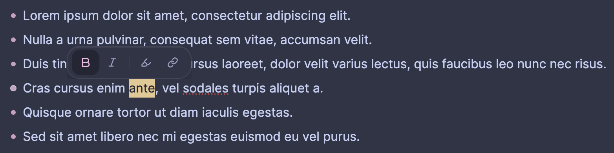

# Logseq Tooltip Format

A floating formatting toolbar for [Logseq](https://logseq.com/). Select any text in a block and a compact toolbar appears above the selection, letting you apply or remove formatting with a single click.



## Features

**Four formatting actions, mutually exclusive**

| Button | Format | Markdown |
|--------|--------|----------|
| **B** | Bold | `**text**` |
| *I* | Italic | `*text*` |
| H | Highlight | `==text==` |
| `[[ ]]` | Page link | `[[text]]` |

Each action works as a toggle. Clicking a button when its format is already active removes the markers; clicking a different button first strips any existing format and then applies the new one — so you never end up with malformed sequences like `***`.

**Smart selection handling**

The toolbar detects active formats whether the markers are selected as part of the text or sit just outside the selection range. Either way the correct markers are added or removed.

**Automatic theme sync**

The toolbar reads Logseq’s CSS custom properties at display time and mirrors them into its own shadow document, so it always matches the active theme’s background, text, border, and accent colours — including dark mode.

**Polished UI**

- Frosted-glass card with layered shadow and a subtle hairline border
- Spring entrance animation (scale + slide-up) that replays on every appearance
- Hover: icon scales up and shifts to the theme accent colour
- Active state: solid accent colour fill with white icon — always readable, regardless of theme
- Click: snappy press animation

## Usage

1. Open any block in editing mode
2. Select some text — the toolbar appears above the selection
3. Click a button to apply or toggle formatting
4. Press `Escape` or click elsewhere to dismiss the toolbar without making changes

Clicking a button while a different format is already active automatically removes the existing format before applying the new one. Clicking the currently active button removes the format.

## Installation

### Build from source

```bash
git clone git@github.com:nicolai92/logseq-tooltip-format.git
cd logseq-tooltip-format
npm install
npm run build
```

Then load the `dist/` folder as an unpacked plugin in Logseq.
